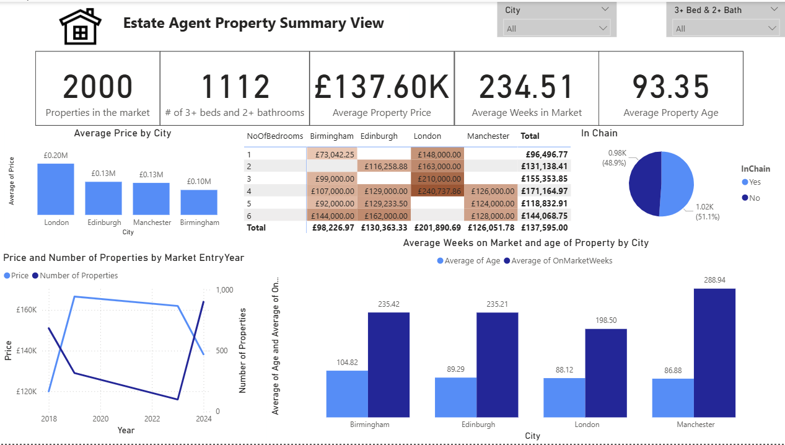

# 🏘 Estate Housing Market Performance Reporting Dashboard  
**Power BI | Power Query | DAX**

---

## 📌 Project Overview

This project delivers a structured business intelligence dashboard designed to analyze and compare housing market performance across two estate agents.

The objective was to unify disparate datasets, standardize their structure, and generate actionable insights aligned with defined business objectives related to pricing trends, market activity, property features, and regional performance.

---

## 🎯 Project Objective

To integrate and analyze housing datasets from two estate agents in order to:

- Identify pricing trends across cities  
- Evaluate property market entry patterns  
- Analyze property feature demand  
- Compare regional housing performance  
- Support data-driven sales and investment decisions  

---

## 🛠 Data Preparation & Transformation

Extensive preprocessing was performed using **Power Query** to ensure schema consistency and analytical accuracy.

### Key Data Engineering Steps

- Aligned Estate Agent 2 dataset schema with Estate Agent 1  
- Standardized column naming conventions and data types  
- Converted currency fields to numeric format for accurate aggregation  
- Split composite address fields into structured components:
  - House Number  
  - Street  
  - City  
- Calculated `YearBuilt` from `Age` using custom column logic  
- Derived `OnMarketDate` from `DaysOnMarket` using `Date.AddDays()`  
- Standardized categorical fields (e.g., Chain → InChain Yes/No)  
- Appended both datasets into a unified reporting table  
- Created a unique ID column to support aggregation and drill-down analysis  

These transformations ensured data integrity, analytical consistency, and scalability for reporting.

---

## 📊 Dashboard Outputs

The final Power BI dashboard addresses key business objectives, including:

- Identification of cities with the lowest average property prices  
- Analysis of average time on market segmented by bedroom count  
- Percentage breakdown of properties within a sales chain  
- Comparison of average property age across cities  
- Property feature demand analysis (bedroom/bathroom combinations)  

Interactive visuals enable filtering by city, property type, and other key dimensions to support strategic decision-making.

---

## 🧮 Data Modeling & DAX

The dashboard leverages DAX measures to:

- Calculate average property prices by region  
- Compute average days on market by bedroom count  
- Derive percentage of properties in chain  
- Compare property age distributions across cities  
- Analyze demand patterns based on bed/bath combinations  

---

## 🧰 Tools & Technologies Used

- **Power BI Desktop**
- **Power Query** (Schema alignment, transformation, custom columns)
- **DAX** (Calculated measures, KPIs, and aggregation logic)

---

## 📈 Skills Demonstrated

- Multi-source data integration  
- Schema harmonization  
- Advanced data transformation  
- Business metric modeling using DAX  
- Interactive dashboard development  
- Insight-driven reporting aligned to business objectives  

---
## 📊 Dashboard Preview

  

The dashboard provides interactive insights into pricing trends, market performance, and property demand patterns.
